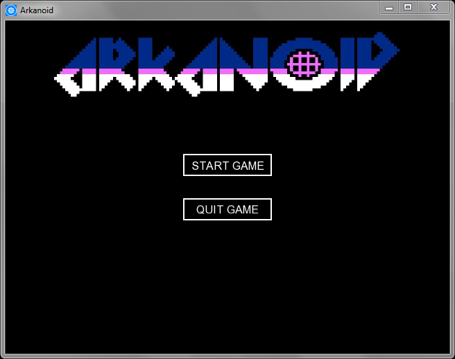
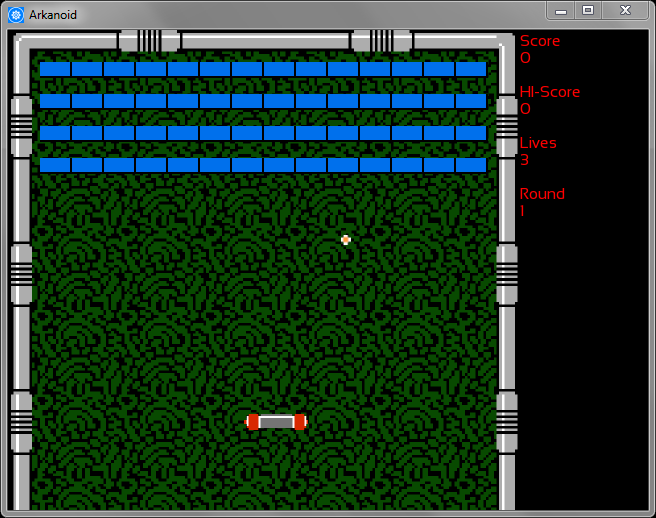
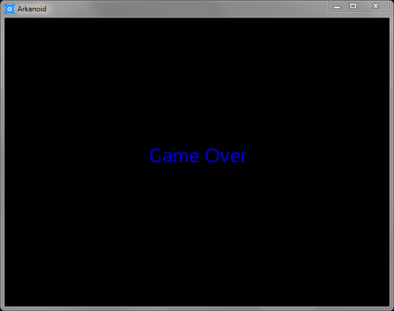

# is::Engine Tutorial Arkanoid (Empty)
### Compatible Platforms:
- Android
- Web (HTML 5 - CSS 3)
- Windows / Linux

### Supported tools:
- [Android Studio](https://github.com/Is-Daouda/is-Engine#-android-studio)
- [Code::Blocks](https://github.com/Is-Daouda/is-Engine#-codeblocks)
- [CMake](https://github.com/Is-Daouda/is-Engine#-cmake)
- [Emscripten](https://github.com/Is-Daouda/is-Engine#-web-html-5---css-3)
- [Qt](https://github.com/Is-Daouda/is-Engine#-qt)
- [Visual Studio Code](https://github.com/Is-Daouda/is-Engine#-visual-studio-code)

##  Very important
Since the game engine has evolved a lot, some part of the Youtube tutorial no longer corresponds to this one!<br/>
These details mentioned below allow to adapt this new version of the engine to the youtube tutorial:
1. Music files in **.ogg** format have been replaced by **.wav**.
2. The constructor of the scenes classes have changed :
- This constructor has been replaced (take the case of the **GameMenu class**) :
```cpp
GameMenu(sf::RenderWindow &window, sf::View &view, is::Render &surface, is::GameSystemExtended &gameSysExt):
	GameDisplay(window, view, surface, gameSysExt, sf::Color::Black /* => scene color*/) {}
```
- By this one :
```cpp
GameMenu(is::GameSystemExtended &gameSysExt):
	GameDisplay(gameSysExt, sf::Color::Black /* => scene color*/) {}
```

### Description:
This project is for use with the [Youtube Tutorial](https://youtu.be/wo2-ofNB7Hw) which shows how to create a game with is::Engine.
It already contains the resources (sprites, sounds, fonts) for creating the game.

### Web game link:
► http://is-daouda.github.io/



