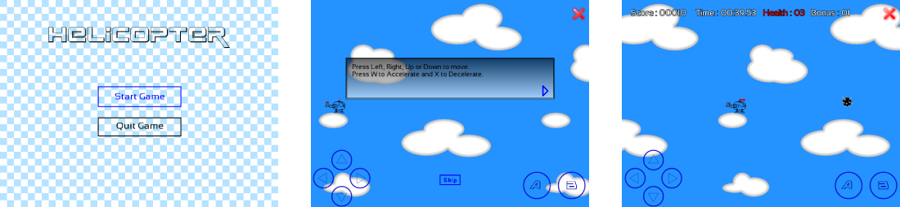
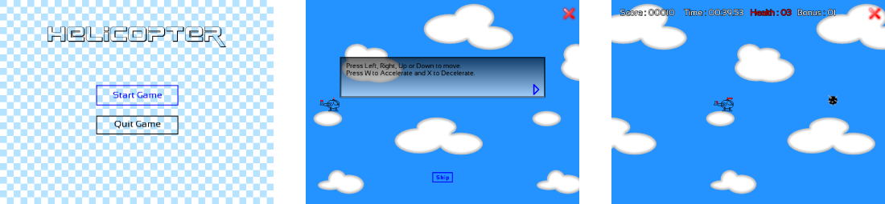

# is::Engine Tutorial Project

Project of the tutorial which is in the **[user guide](https://github.com/Is-Daouda/is-Engine/tree/2.2.x/doc)** of the game engine **[is::Engine](https://github.com/Is-Daouda/is-Engine)**. The project was built with these different components: **Virtual Game Pad for Android, Keyboard, Standard Engine Function, Scenes, Language Manager, Sprite Animation, RPG Dialog Box, Basic Collision Engine, Stopwatch. Transition.**

### Android Screenshot

### PC Screenshot

## In this directory you have tree (4) projects :
- **AndroidStudio**        : for Android development with Android Studio
- **CodeBlocks**           : for PC development with Code::Blocks
- **CMake**           	   : for PC development with CMake
- **VSCode**               : for PC development with Visual Studio Code

## Prerequisites
- SFML Library (2.4 +)

**AndroidStudio**
- Install Android Studio (3.1.3 +)
- Android SDK and NDK (r12b)
- Firebase C++ SDK 4.5.0 (If you need it)

**CodeBlocks**
- Install Code::Blocks (20.03)
- GCC Compiler

**CMake**
- CMake (3.1 +)

**VSCode**
- Visual Studio Code (1.42.0 +)
- GCC Compiler
- Git Bash (For Windows only)

## Todo
Everything has already been configured all you need to do in relation to the tree (4) projects is to link the libraries